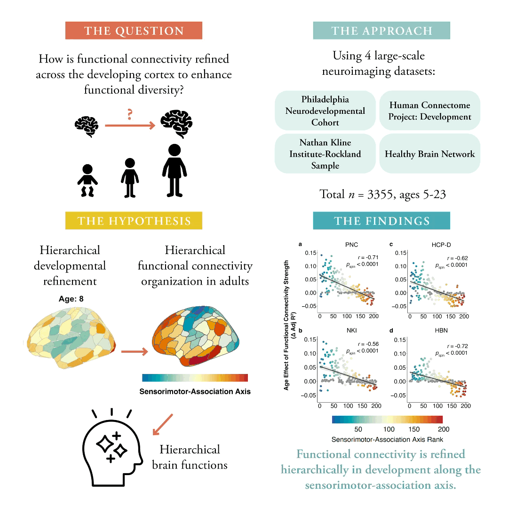

## Functional Connectivity Development along the Sensorimotor-Association Axis Enhances the Cortical Hierarchy  
**Article**: [https://www.nature.com/articles/s41467-024-47748-w](https://www.nature.com/articles/s41467-024-47748-w)

**Study preregistration**: [https://osf.io/vf8ew](https://osf.io/vf8ew)

**Preprint**: [https://www.biorxiv.org/content/10.1101/2023.07.20.549090v1](https://www.biorxiv.org/content/10.1101/2023.07.20.549090v1)

A detailed **reproducibility guide** and **description of the code** can be found 
at 
[https://pennlinc.github.io/network_replication/](https://pennlinc.github.io/network_replication/)

 

**Figure data**: Luo, A. C. (2024). Functional Connectivity Development along the Sensorimotor-Association Axis Enhances the Cortical Hierarchy [Data set]. In Nature Communications. Zenodo. https://doi.org/10.5281/zenodo.10818786
