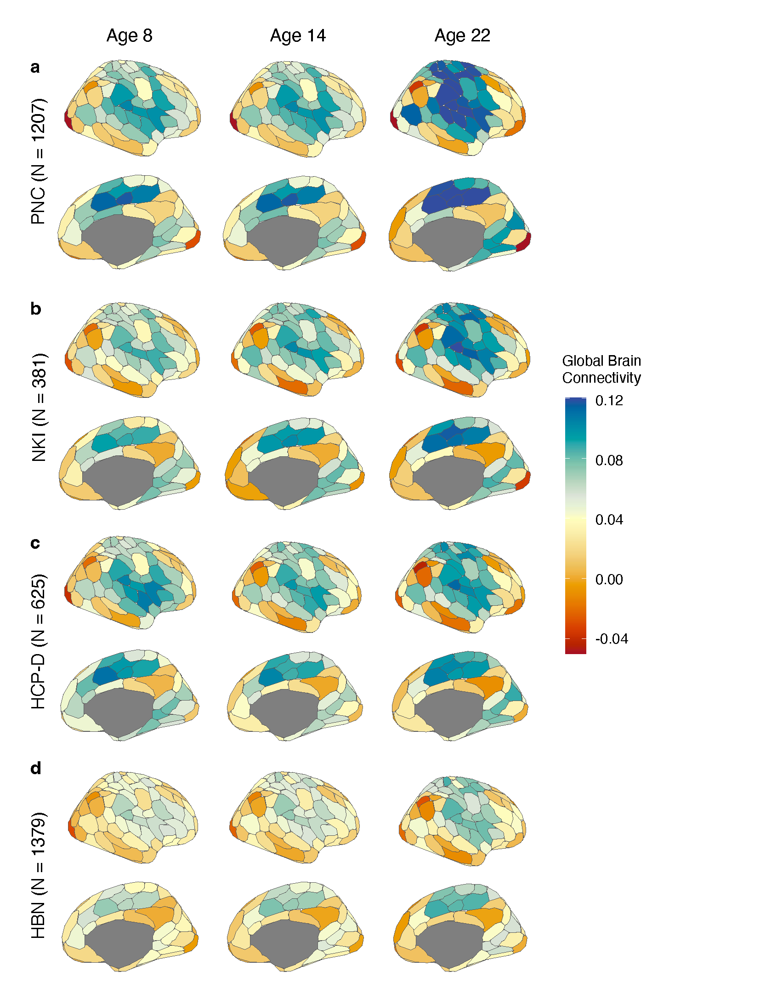
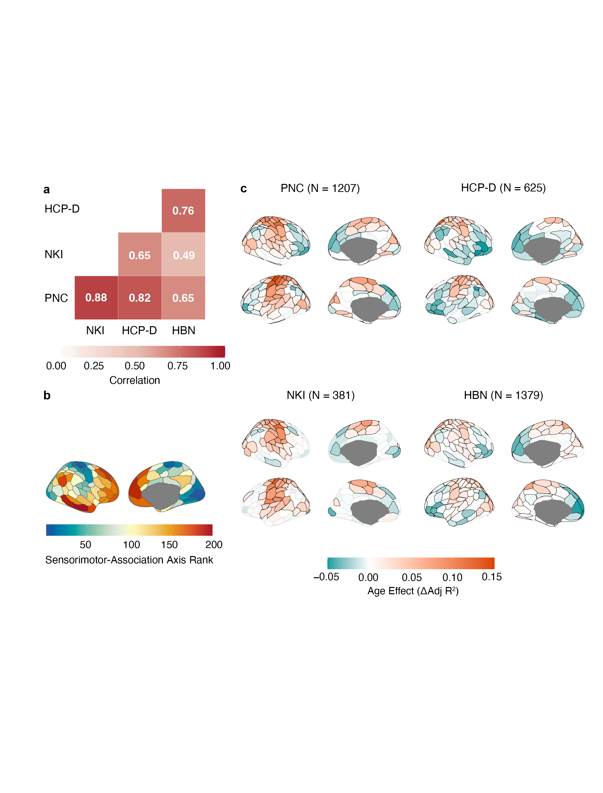
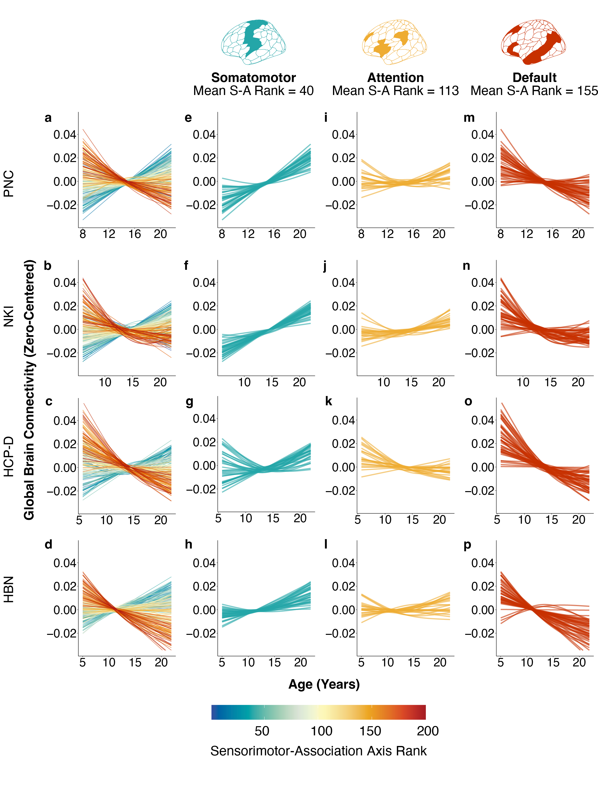
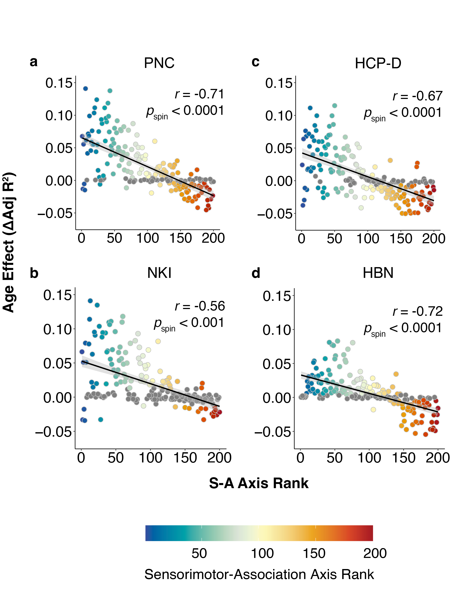
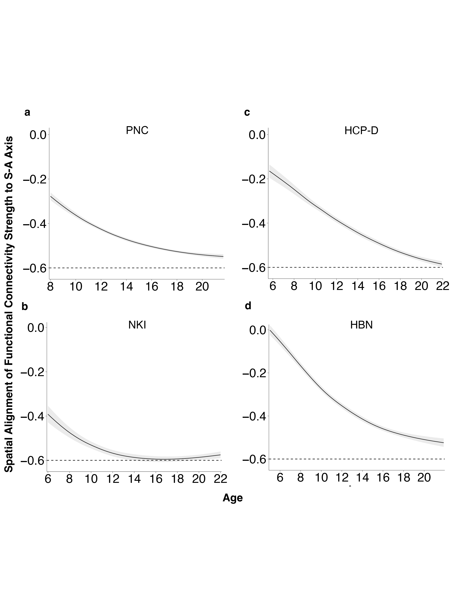
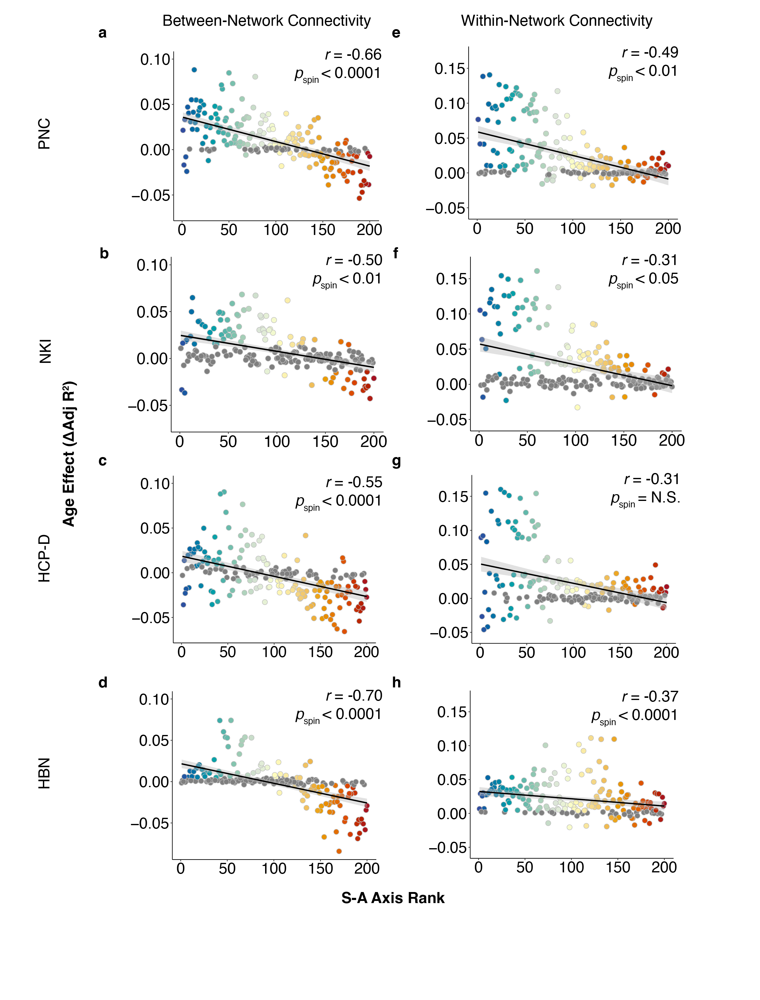
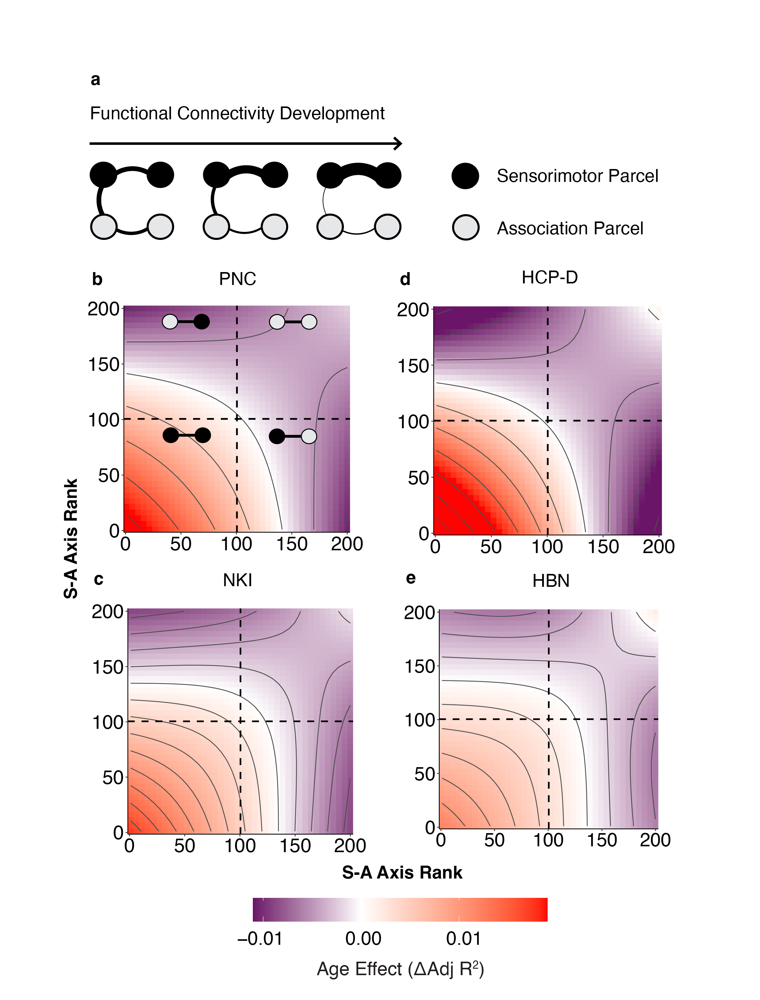

<br>
<br>

# Functional Connectivity Development Aligns with the Sensorimotor-Association Cortical Axis in Four Independent Datasets 

Cortical maturation has been posited to be organized along the sensorimotor-association axis, a hierarchical axis of brain organization that spans from unimodal sensorimotor cortices to transmodal association cortices. In this preregistered study, we used four large-scale datasets to investigate whether the development of functional connectivity reliably varies along the sensorimotor-association axis during childhood through adolescence. To do so, we examined four datasets that included youth ages 5-22: the Philadelphia Neurodevelopmental Cohort (N=1207), Nathan Kline Institute-Rockland (N=381), Human Connectome Project: Development (N=625), and Healthy Brain Network (N=1379). Across all datasets, the spatial patterning of connectivity at region aligned with the S-A axis through development. Specifically, global connectivity in sensorimotor regions increased, whereas global connectivity declined in association cortices. Convergent findings across four independent datasets robustly establish that the sensorimotor-association axis is not only a major axis of brain organization, but also encodes the dominant pattern of functional connectivity development.

### Project Lead
Audrey Luo

### Faculty Lead
Theodore D. Satterthwaite

### Analytic Replicator
Valerie J. Sydnor

### Collaborators 
Valerie J. Sydnor, Arielle S. Keller, Aaron F. Alexander-Bloch, Matthew Cieslak, Sydney Covitz, Andrew Chen, Eric Feczko, Alexandre R. Franco, Raquel E. Gur, Ruben C. Gur, Audrey Houghton, Fengling Hu, Gregory Kiar, Bart Larsen, Adam Pines, Giovanni Salum, Tinashe Tapera, Ting Xu, Chenying Zhao, Damien A. Fair, Michael P. Milham, Theodore D. Satterthwaite

### Project Start Date
December 2021

### Current Project Status
In preparation

### Datasets
RBC PNC (Health excude), NKI, HCP-D, and HBN

### Github Repository
<https://github.com/PennLINC/network_replication>
### Slack Channel:
#network_replication 

### Conference Presentations
 
- Poster presented at Flux Congress, September 2022.
- Poster to be presented at Organization for Human Brain Mapping, July 2023

### Cubic Project Directory
`/cbica/projects/network_replication`
<br>

`/software/`: project software 

`/Rscripts/`: contains functions for main and sensitivity analyses as well as Rmd files for each step of the analytic workflow (see below) for each dataset. 

`/atlases/dlabel/*.nii` : Cortical parcellations for Schaefer 200 (7 and 17 network), Schaefer 400 (7 and 17 network), Gordon, and HCP-MMP 

`/atlases/parcellations/*regionlist_final.csv`: parcel labels for each cortical parcellation (see below) used for study

`/atlases/edge/*_edge.csv`: edge names used for edge-level analysis for each cortical parcellation

`/input/<dataset>/datalad_xcp/`: MRI data for each dataset pulled via datalad get

`/input/<dataset>/<dataset>_xcp/`: only fMRI data in fsLR space and qc data for each subject


`/input/<dataset>/connMatricesData/connectivity_matrices`: connectivity matrices derived from concatenated task and rest fMRI scans 
 
<br>

Demographics .csv's all live in `/input/<dataset>/sample_selection` but have different file names: 
* PNC: `pnc_participants.tsv` 
* NKI: `nki_participants.tsv`
* HCP-D: `hcpd_demographics.csv`
* HBN: `participants.tsv`

<br>

Final sample lists for each dataset all live in `/input/<dataset>/sample_selection` but have different file names:
* PNC: `PNC_demographics_finalsample_20230103.csv` 
* NKI: `NKI_demographics_finalsample_20221219.csv`
* HCP-D: `HCPD_demographics_finalsample_20221226.csv`
* HBN: `HBN_demographics_finalsample_202230226.csv`

`/output/<dataset>/<functional_connectivity_metric>/GAM`: GAM results. Includes effect sizes, p-values, fitted- values, smooth estimates. Outputs for HBN and HCP-D include covbat harmonized outputs. 
<br>
<br>

# CODE DOCUMENTATION  

All project analyses are described below along with the corresponding code on Github. The following outline describes the order of the analytic workflow:

1. Parcellating the sensorimotor-association (S-A) axis  
2. Sample selection for each dataset: PNC (discovery), NKI, HCP-D, and HBN (replication)  
3. Constructing connectivity matrices for each dataset 
4. Quantification of functional connectivity metrics: global brain connectivity, between- and within-network connectivity  
5. Image harmonization: applying [covbat-gam](https://github.com/andy1764/ComBatFamily) to multi-site data (HCP-D and HBN)
6. Fitting generalized additive models (GAMs) 
7. Characterization of relationships between functional connectivity metrics, age, and the S-A axis

 
<br>

### 1. Parcellating the sensorimotor-association (S-A) axis  
We parcellated the fslr/cifti [Sensorimotor-Association Axis](https://github.com/PennLINC/S-A_ArchetypalAxis/blob/main/FSLRVertex/SensorimotorAssociation_Axis.dscalar.nii) with cortical atlases (Schaefer 200, Schaefer 400, Gordon, and HCP-MMP) using [/Rscripts/Generate_input/1_parcellate_SAaxis.Rmd](https://github.com/PennLINC/network_replication/blob/main/Generate_input/1_parcellate_SAaxis.Rmd).


### 2. Sample selection for each dataset: PNC (discovery), NKI, HCP-D, and HBN (replication)  
The final samples for each dataset were constructed using 
```
/Rscripts/<dataset>/QC_scripts/<dataset>_SampleSelection.Rmd
```
Links to the corresponding github code and descriptions of each final sample are as follows: 

* PNC: [PNC_SampleSelection.Rmd](https://github.com/PennLINC/network_replication/blob/main/PNC_scripts/QC_scripts/PNC_SampleSelection.Rmd)

        1) Original sample: N=1559, 4546 scans total, ages 8-22
        2) Exclude participants with medical conditions affecting brain function, gross neurological abnormalities, and psychoactive medical medications: N=1413, 4136 scans 
        3) Include passing T1 QC: N=1374, 4041 scans
        4) Include meanFD < 0.3: N=1262, 3365 scans
        5) Include scans with at least 7 minutes of scan time: N= 1207,  3310 scans (final sample), 646 females. Age: mean = 15, SD = 3.3.
                - range before: 3.60 to 33.25 min
                - median before: 28.25 min
                - range after: 8.35 to 33.25 min
                - median after: 28.25 min 


* NKI: [NKI_SampleSelection.Rmd](https://github.com/PennLINC/network_replication/blob/main/NKI_scripts/QC_scripts/NKI_SampleSelection.Rmd)

        1) Original sample: N=1268, ages 6-85, 6226 scans total
        2) Include ages 6-22: N=424, 2570 scans
        3) Include passing T1 QC: N=402, 2281 scans. 
        - delete all scans from a given session if fail T1 
        4) Include meanFD < 0.3: N=386, 1816 scans
        5) Choose the session that has the most scans surviving the head motion exclusion: N=386, 998 scans
        6) Include scans with at least 7 minutes of scan time: N=381, 993 scans (final sample),  177 females. Age: mean=14.5, SD=4.4
                - range before: 5.00000 to 24.10167 min
                - median before: 24.10167 min
                - range after: 7.75075 to 24.10167 min
                - median after: 24.10167 min

* HCP-D: [HCPD_SampleSelection.Rmd](https://github.com/PennLINC/network_replication/blob/main/HCPD_scripts/QC_scripts/HCPD_SampleSelection.Rmd)

        1) Original sample: N=652, ages 5-21, 5716 scans total
        2) Exclude participants with medical conditions affecting brain function, gross neurological abnormalities: N=631, 5527 scans
        3) Include passing T1 QC: all scans in dataset have survived T1 QC already 
        4) Include meanFD < 0.3: N=629, 5165 scans 
        5) Include scans with at least 7 minutes of scan time: N=625, 5159 scans (final sample), 337 females. Age: mean=14.5, SD=4.1
                - range before: 2.24000 to 42.66667 min
                - median before: 42.66667 min
                - range after: 7.466667 to 42.66667 min
                - median after: 42.666667 min

* HBN: [HBN_SampleSelection.Rmd](https://github.com/PennLINC/network_replication/blob/main/HBN_scripts/QC_scripts/HBN_SampleSelection.Rmd)

        1) Original sample: N= 2255, ages 5-21, 6915 scans total
        2) Exclude participants with medical conditions affecting brain function, gross neurological abnormalities: no medical exclusion in HBN
        3) Include passing T1 QC: pending T1 QC from RBC
        4) Include meanFD < 0.3: N= 1649, 3964 scans 
        5) Include scans with at least 7 minutes of scan time: N= 1438, 3939 scans (final sample), 546 females
                - range before: 3.333333 to 23.333333 min
                - median before: 13.33333 min  
                - range after: 8.333333 23.333333
                - median after: 18.33333
        6) Exclude participants with missing data (i.e. age and sex): N= 1379, 3767 scans, 546 females. Age: mean=11.6, sd= 3.7

### 3. Constructing connectivity matrices for each dataset

fMRIPrep 20.2.3 (PNC and NKI) and 22.0.2 (HCP-D and HBN) were run with the following parameters:

```bash
$  /usr/local/miniconda/bin/fmriprep inputs/data prep participant -w /scratch/rbc/SGE_820171/$subid/ds/.git/tmp/wkdir --n_cpus 1 --stop-on-first-crash --fs-license-file code/license.txt --skip-bids-validation --bids-filter-file /scratch/rbc/SGE_820171/$subid.json --output-spaces MNI152NLin6Asym:res-2 --participant-label $subid --force-bbr --cifti-output 91k -v -v
```

xcp-d 0.0.8 (NKI) and 0.3.2 (PNC, HCP-D, HBN) were run with the following parameters: 

```bash
$ /usr/local/miniconda/bin/xcp_abcd inputs/data/fmriprep xcp participant --despike --nthreads 1 --lower-bpf 0.01 --upper-bpf 0.08 --participant_label $subid -p 36P -f 10 --cifti

```


**Main analysis:**  
Vertex-level fMRI timeseries were parcellated with fsLR surface atlases utilizing Connectome Workbench 1.5.0.19. This produced fMRI timeseries within individual cortical regions. The Schaefer200 atlas was used as the primary atlas and Schaefer 400, HCP-MMP, and Gordon atlases were used in sensitivity analyses. Next, parcellated rest and task fMRI timeseries were concatenated and the Pearson correlation between concatenated timeseries was computed for every pair of cortical regions. 

*Data*: task and resting-state fMRI were concatenated using 
```
/Rscripts/<dataset>_scripts/ConnMatrices_scripts/<dataset>_makeConnMatrices.R
```
+ PNC: [PNC_makeConnMatrices.R](https://github.com/PennLINC/network_replication/blob/main/PNC_scripts/ConnMatrices_scripts/PNC_makeConnMatrices.R)
+ NKI: [NKI_makeConnMatrices.R](https://github.com/PennLINC/network_replication/blob/main/NKI_scripts/ConnMatrices_scripts/NKI_makeConnMatrices.R)
+ HCP-D: [HCPD_makeConnMatrices.R](https://github.com/PennLINC/network_replication/blob/main/HCPD_scripts/ConnMatrices_scripts/HCPD_makeConnMatrices.R)
+ HBN:  [HBN_makeConnMatrices.R](https://github.com/PennLINC/network_replication/blob/main/HBN_scripts/ConnMatrices_scripts/HBN_makeConnMatrices.R)

*Cortical parcellation*: [Schaefer 200 atlas](https://github.com/PennLINC/xcp_d/blob/main/xcp_d/data/ciftiatlas/Schaefer2018_200Parcels_17Networks_order.dlabel.nii)
+ *Network solution*: [7 Network](https://github.com/ThomasYeoLab/CBIG/blob/6d1400a2d643261246f6b042e7ef5fbe417506cd/utilities/matlab/FC/CBIG_ReorderParcelIndex.m) 

**Sensitivity analysis:** 

To investigate whether our findings were driven by potentially confounding factors including use of task and rest scans and atlas used for cortical parcellation. Sensitivity analyses were performed with only resting state data while excluding fMRI acquired during task conditions. Datasets used in this rest-only sensitivity analysis include PNC, HCP-D, and HBN. Analyses for NKI were completed with resting-state fMRI only due to absence of task scans. We only included participants with at least 6 minutes of resting-state fMRI. We analyzed data from 998 participants (549 females) from PNC, 611 participants (328 females) from HCP-D, and 1039 participants (426 females). The total scan time for fully acquired resting-state scans was 11 minutes and 12 seconds (224 volumes) for PNC, 25 minutes and 30 seconds (1912 volumes) for HCP-D, and 10 minutes and 9 seconds (750 volumes) for HBN. 

Second, analyses were also evaluated using additional cortical parcellations. Our primary parcellation utilized the Schaefer 200 atlas; secondary atlases included the Schaefer 400 atlas, the Gordon atlas, and HCP-MMP atlas. For analyses of secondary outcome measures that require community structure, namely average between- and within-network connectivity, we evaluated both the Yeo 7 and 17-network partitions associated with the Schaefer atlas. Results from sensitivity analyses are presented in the supplement.

*Data*: resting-state fMRI only was used to construct conn matrices using 
```
/Rscripts/<dataset>_scripts/ConnMatrices_scripts/<dataset>_makeConnMatrices_restOnly.R
``` 


* PNC: [PNC_makeConnMatrices_restOnly.R](https://github.com/PennLINC/network_replication/blob/main/PNC_scripts/ConnMatrices_scripts/PNC_makeConnMatrices_restOnly.R)
* NKI: no sensitivity analyses done with resting-state only since NKI only has resting-state to begin with! 
* HCP-D: [HCPD_makeConnMatrices_restOnly.R](https://github.com/PennLINC/network_replication/blob/main/HCPD_scripts/ConnMatrices_scripts/HCPD_makeConnMatrices_restOnly.R)
* HBN:  [HBN_makeConnMatrices_restOnly.R](https://github.com/PennLINC/network_replication/blob/main/HBN_scripts/ConnMatrices_scripts/HBN_makeConnMatrices_restOnly.R)

*Cortical parcellation*: [Schaefer 400](https://github.com/PennLINC/xcp_d/blob/main/xcp_d/data/ciftiatlas/Schaefer2018_400Parcels_17Networks_order.dlabel.nii), [HCP multimodal](https://github.com/PennLINC/xcp_d/blob/main/xcp_d/data/ciftiatlas/glasser_space-fsLR_den-32k_desc-atlas.dlabel.nii), [Gordon](https://github.com/PennLINC/xcp_d/blob/main/xcp_d/data/ciftiatlas/gordon_space-fsLR_den-32k_desc-atlas.dlabel.nii)
* *Network solution*: 7 Network and 17 Network (Schaefer atlases)


### 4. Quantification of functional connectivity metrics 

Global brain connectivity (GBC) was calculated for each cortical parcel by averaging its timeseries correlation with all other parcels. Hence, global brain connectivity represents the mean edge strength of a given region with all other regions, without thresholding. Average between-network connectivity (BNC) was defined as the mean edge strength (Pearson correlation) of a given region and all other regions not in that region’s network. Average within-network connectivity (WNC) was defined as the mean edge strength (Pearson correlation) of a given region and all other regions within that region’s network. We also examined functional connectivity at the edge level by extracting the Pearson correlation between timeseries for each pair of regions. 

GBC, BNC, WNC, and edge-level connectivity were computed or extracted using 
```
/Rscripts/<dataset>_scripts/Analysis_scripts/1_<dataset>_computeConnMetrics.Rmd
```
+ PNC: [1_PNC_computeConnMetrics.Rmd](https://github.com/PennLINC/network_replication/blob/main/PNC_scripts/Analysis_scripts/1_PNC_computeConnMetrics.Rmd)
+ NKI: [1_NKI_computeConnMetrics.Rmd](https://github.com/PennLINC/network_replication/blob/main/NKI_scripts/Analysis_scripts/1_NKI_computeConnMetrics.Rmd)
+ HCP-D: [1_HCPD_computeConnMetrics.Rmd](https://github.com/PennLINC/network_replication/blob/main/HCPD_scripts/Analysis_scripts/1_HCPD_computeConnMetrics.Rmd)
+ HBN: [1_HBN_computeConnMetrics.Rmd](https://github.com/PennLINC/network_replication/blob/main/HBN_scripts/Analysis_scripts/1_HBN_computeConnMetrics.Rmd)

### 5. Image harmonization: applying [covbat-gam](https://github.com/andy1764/ComBatFamily) to multi-site data (HCP-D and HBN)

[Correcting Covariance Batch Effects (CovBat)](https://onlinelibrary.wiley.com/doi/10.1002/hbm.25688) was used to harmonize multi-site MRI data to ensure the imaging measures were comparable across sites. CovBat was applied to functional connectivity metrics for multi-site dataset (HCP-D and HBN) using the [ComBatFamily R package](https://github.com/andy1764/ComBatFamily). Sex and in-scanner motion were included as covariates with age modeled as a smooth term via a [generalized additive model](https://www.sciencedirect.com/science/article/pii/S1053811919310419?via%3Dihub) using the ‘covfam’ function, which enables flexible covariate modeling with penalized splines.  

Covbat was applied to GBC, BNC, WNC, and edges as part of 
```
/Rscripts/<dataset>_scripts/Analysis_scripts/1_<dataset>_computeConnMetrics.Rmd
```
+ HCP-D: [1_HCPD_computeConnMetrics.Rmd (L187-377)](https://github.com/PennLINC/network_replication/blob/main/HCPD_scripts/Analysis_scripts/1_HCPD_computeConnMetrics.Rmd#L187-L377)
+ HBN: [1_HBN_computeConnMetrics.Rmd (L188-427)](https://github.com/PennLINC/network_replication/blob/main/HBN_scripts/Analysis_scripts/1_HBN_computeConnMetrics.Rmd#L188-L427)


### 6. Fitting generalized additive models (GAMs) 
GAMs were fit for GBC, BNC, WNC, and edge-level connectivity for each cortical region to examine age-dependent changes in each of these functional connectivity metrics. To fit GAMs, estimate GAM smooths, predict fitted GBC values, and compute alignment of fitted GBC values with the S-A axis across age, we used 
```
/Rscripts/<dataset>_scripts/Analysis_scripts/2_<dataset>_fitGAMs.Rmd
``` 
Note that this Rmd has some additional analyses that aren't reported in the paper (I will keep them in there until we are confident we won't need the code anymore).


`/Rscripts/functions/main_analyses/GAM_functions.R` includes the set of functions to fit GAM models. This script includes:  
* *gam.fit*: Function to fit a GAM (measure ~ s(smooth_var) + covariates)) per each region in atlas and save out statistics and derivative-based characteristics
* *gam.predsmooth*: Function to fit GAM smooths based on model-predicted data
* *gam.smooth.predict_posterior*: Function to predict fitted values of a measure based on a fitted GAM smooth (measure ~ s(smooth_var, k = knots, fx = set_fx) + covariates)) and a prediction df and for individual draws from the simulated posterior distribution

`/Rscripts/functions/main_analyses/fitGAMs.R` contains functions for applying the above GAM functions across cortical regions.

`2_<dataset>_fitGAMs.Rmd` consolidates functions from the two .R scripts above and applies them to each dataset. 

* PNC: [2_PNC_fitGAMs.Rmd](https://github.com/PennLINC/network_replication/blob/main/PNC_scripts/Analysis_scripts/2_PNC_fitGAMs.Rmd)
* NKI: [2_NKI_fitGAMs.Rmd](https://github.com/PennLINC/network_replication/blob/main/NKI_scripts/Analysis_scripts/2_NKI_fitGAMs.Rmd)
* HCP-D: [2_HCPD_fitGAMs_withCovbat.Rmd](https://github.com/PennLINC/network_replication/blob/main/HCPD_scripts/Analysis_scripts/2_HCPD_fitGAMs_withCovbat.Rmd)
* HBN: [2_HBN_fitGAMs_withCovbat.Rmd](https://github.com/PennLINC/network_replication/blob/main/HBN_scripts/Analysis_scripts/2_HBN_fitGAMs_withCovbat.Rmd)

Note that running GAMs for edges requires submitting a job on cubic since this process takes many hours. Rscript can be found at `/Rscripts/functions/main_analyses/edge_fitGAMs.R` and shell script found at 
```
/Rscripts/<dataset>_scripts/Analysis_scripts/connMetrics_scripts/fitGAMs_edge_<dataset>.sh
```

### 7. Characterization of relationships between functional connectivity metrics, age, and the S-A axis

We used Spearman’s rank correlations to quantify the association between S-A axis ranks and observed developmental effects. This was performed within 
```
/Rscripts/<dataset>_scripts/Analysis_scripts/3_<dataset>_devEffectFigures.Rmd
``` 
(specifically, in the chunk "Correlations and Spin-based spatial permutation tests"). 

To investigate how the development of edge-level connectivity differs across sensorimotor-association axis, we examined age-related changes in connectivity across edges by fitting a bivariate smooth interaction. The effect of S-A axis rank on edge-level age effects was modeled using a tensor product smooth. This analysis was performed for all datasets together in [/Rscripts/CombinedFigures/CombinedFigures.Rmd](https://github.com/PennLINC/network_replication/blob/main/CombinedFigures/CombinedFigures.Rmd#L413-L519). 


<br>

# Data Interpretation and Visualization 
 
Model results and correspondence of developmenta effects to the S-A axis were computed and visualized in the following:

1. [CombinedFigures.Rmd](https://github.com/PennLINC/network_replication/blob/main/CombinedFigures/CombinedFigures.Rmd)
* Generates figures 1, 2, and 7 for manuscript 
* Plots the cortical distribution of fitted GBC values at ages 8, 14 and 22
* Quantifies spatial correlation of age effect of global brain connectivity between all datasets
* Examines the cortical distribution of GBC age effect
* Characterizes the distribution of edge-level connectivity age effect along the S-A axis in a topographical surface plot

2. `/Rscripts/<dataset>)scripts/Analysis_scripts/3_<dataset>_devEffectFigures.Rmd`
* Generates figures 3, 4, 5, 6 for manuscript 
* Computes correlation between S-A axis rank and age effect of connectivity metrics and performs spin-based spatial permutation tests for significance testing
* Calculates age smooths for each functional connectivity metric, and examines smooths for representative parcels from the somatomotor, attention, and default networks 
* Examines the alignment of fitted GBC values with the S-A axis across 200 ages 

  * PNC: [3_PNC_devEffectFigures.Rmd](https://github.com/PennLINC/network_replication/blob/main/PNC_scripts/Analysis_scripts/3_PNC_devEffectFigures.Rmd)
  * NKI: [3_NKI_devEffectFigures.Rmd](https://github.com/PennLINC/network_replication/blob/main/NKI_scripts/Analysis_scripts/3_NKI_devEffectFigures.Rmd)
  * HCP-D: [3_HCPD_devEffectFigures_withCovbat.Rmd](https://github.com/PennLINC/network_replication/blob/main/HCPD_scripts/Analysis_scripts/3_HCPD_devEffectFigures_withCovbat.Rmd)
  * HBN: [3_HBN_devEffectFigures_withCovbat.Rmd](https://github.com/PennLINC/network_replication/blob/main/HBN_scripts/Analysis_scripts/3_HBN_devEffectFigures_withCovbat.Rmd)


### Figure 1. The spatial distribution of global brain connectivity is highly similar across all four datasets and is refined with age. 


### Figure 2. Global brain connectivity developmental effects replicate across four large datasets. 


### Figure 3. Global brain connectivity shows dissociable patterns of maturation across the sensorimotor-association axis.


### Figure 4. Developmental change in global brain connectivity aligns with the sensorimotor-association axis. 


### Figure 5. The spatial distribution of global brain connectivity increasingly aligns with the sensorimotor-association axis with age.  



### Figure 6. Hierarchical developmental change in average between-network and within-network connectivity. 


### Figure 7. Edge-level age effects confirm divergent connectivity refinement along the sensorimotor-association axis. 


### A note on sensitivity analyses
As described above, sensitivity analyses were performed using only resting-state fMRI and with multiple cortical parcellations.

Analyses using only resting-state can be found in
```
/Rscripts/<dataset>_scripts/Analysis_scripts/sensitivity_analyses
```
  * PNC: [sensitivity_analyses](https://github.com/PennLINC/network_replication/tree/main/PNC_scripts/Analysis_scripts/sensitivity_analyses)
  * NKI: [sensitivity_analyses](https://github.com/PennLINC/network_replication/tree/main/NKI_scripts/Analysis_scripts/sensitivity_analyses)
  * HCP-D:[sensitivity_analyses](https://github.com/PennLINC/network_replication/tree/main/HCPD_scripts/Analysis_scripts/sensitivity_analyses)
  * HBN: [sensitivity_analyses](https://github.com/PennLINC/network_replication/tree/main/HBN_scripts/Analysis_scripts/sensitivity_analyses)

Sensitivity analyses with cortical parcellations were done alongside the main analyses (Schaefer 200) in the .Rmd's linked above (1_computeConnMetrics, 2_fitGAMs, and 3_devEffectFigures). 